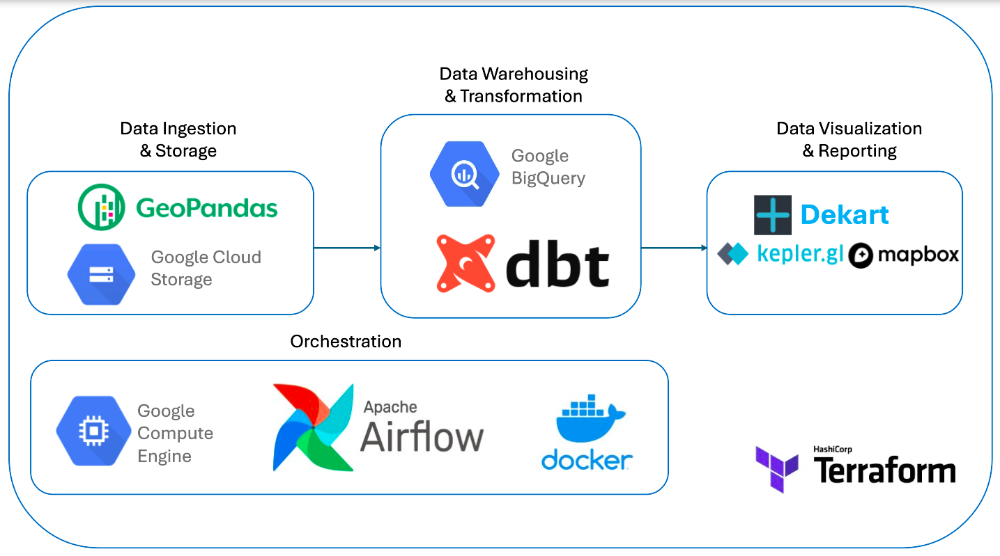
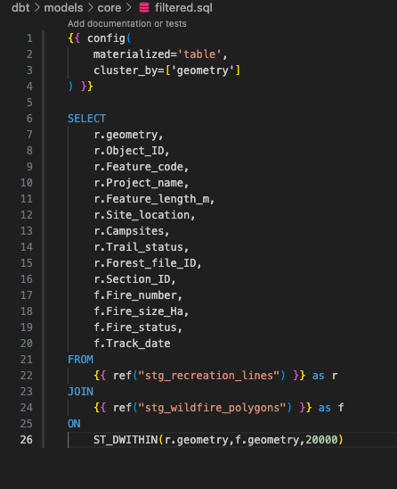

 <!-- Custom anchor -->
# BC Wildfires & Recreational Trails Data Engineering Project
As part of the [Data Engineering Zoomcamp](https://github.com/DataTalksClub/data-engineering-zoomcamp) by [DataTalks.Club](https://datatalks.club), this project marks the final component of the course. Many thanks to the instructors that contributed to building this educational resource.

## Table of Contents
[Purpose](#purpose)

  
<a href="#web-map">Web Map</a>

  
  - [Figure 1](#figure-1). Overview of the final report visualized as a web map application using Dekart.
  - [Figure 2](#figure-2). Summary table of recreation trails and counts of nearby (within 20km) active and inactive wildfires viewed in the map application.

  
<a href="#data-stack">Data Stack</a>

  
  - [Figure 3](#figure-3). Diagram modelling the tools used in this project.

  
<a href="#data-sources">Data Sources</a>

  
  - [Figure 4](#figure-4). Example of visualization of wildfire perimeters data in the final report.
  - [Figure 5](#figure-5). Example of visualization of recreation trails data in the final report.

[Setup](#setup)

  
<a href="#workflow-orchestration">Workflow Orchestration</a>

  
  - [Figure 6](#figure-6). Sample of shapefile contents from data source.
  - [Figure 7](#figure-7). Comparison between geojson and newline-delimited geojson format, processed using the geojson2ndjson command-line tool.
  - [Figure 8](#figure-8). Airflow DAG graph for processing the recreation trails dataset.
  - [Figure 9](#figure-9). Airflow DAG graph for processing the wildfire perimeters dataset.
  - [Figure 10](#figure-10). Airflow DAG graph for running the DBT models (staging and core)

  
<a href="#data-warehouse-transformations">Data Warehouse Transformations</a>

  - [Figure 11](#figure-11). SQL code in the DBT staging model that transforms raw data stored in BigQuery.
  - [Figure 12](#figure-12). SQL code in the DBT core model that performs a spatial join on staging data in BigQuery.
  - [Figure 13](#figure-13). Diagram of the staging and core DBT model dependencies.

[Future Opportunities](#future-opportunities)

## Purpose
The purpose of this project is to design a prototype of a modern data pipeline focused on wildfire activity and recreational trails in British Columbia (BC), Canada.

### Background
[Statistics](https://www2.gov.bc.ca/gov/content/safety/wildfire-status/about-bcws/wildfire-history) from the 2023 wildfire season:
  - 2,245 wildfires burned more than 2.84 million hectares of forest and land.
  - 29,900 calls were made to the Provincial Wildfire Reporting Centre, generating 18,200 wildfire reports.
  - There were an estimated 208 evacuation orders which affected approximately 24,000 properties and roughly 48,000 people.

Wildfire season in BC is also the season during which outdoor recreational activity is very popular. The province is well-known for its beautiful, mountainous, and coastal landscape with ample opportunity for hiking, camping, mountain biking etc.

The final deliverable of this project is a web map application visualizing provincial datasets of wildfire perimeters and recreational trails analyzed to be within 20 kilometers of any wildfire, active or inactive.

## Web Map
Click [here](https://cloud.dekart.xyz/reports/aa9a407a-d5b9-48f9-bba5-6940e4c5a69d) to view. Requires login with a Google account. (May initially take a few minutes to download data)
\
\

Figure 1. Overview of the final report visualized as a web map application using Dekart.
\
\

\

Figure 2. Summary table of recreation trails and counts of nearby (within 20km) active and inactive wildfires viewed in the map application.

## Data Stack
- **Development Platform**: Docker
- **Infrastructure as Code (IAC)**: Terraform
- **Orchestration**: Apache Airflow
- **Data Lake**: Google Cloud Storage
- **Data Warehouse**: Google Big Query
- **Transformation Manager**: Data Built Tool (DBT)
- **Data Visualization**: Dekart (built on top of kepler.gl and mapbox)

### Architecture

\

Figure 3. Diagram modelling the tools used in this project.

## Data Sources
- **[BC Wildfire Fire Perimeters - Current](https://catalogue.data.gov.bc.ca/dataset/bc-wildfire-fire-perimeters-current)**
  - This is a spatial layer (shapefile) of polygons showing both active and inactive fires for the current fire season. The data is refreshed from operational systems every 15 minutes. These perimeters are rolled over to Historical Fire Polygons on April 1st of each year. With automation in this project, this dataset is dynamic.
  - Limitations:
    - *Wildfire data may not reflect the most current fire situation as fires are dynamic and circumstances may change quickly. Wildfire data is refreshed when practicable and individual fire update frequency will vary.*
- **[Recreation Line](https://catalogue.data.gov.bc.ca/dataset/recreation-line)**
  - This is a spatial layer (shapefile) of polylines showing features such as recreation trails. In this project, this dataset is static.
  - Limitations:
    - *These polylines represent recreational trails and may not include recreational projects where polygon features would be more appropriate. Trails that are not registered within the BC Minstry of Forests are not included. Data is not updated on a regular schedule and the decision was made to keep this data static for the purposes of this project.*
 
- All data was obtained through the BC Data Catalogue. Original sources include BC Wildfire Service and Recreational Sites & Trails BC. (Attribution: Contains information licensed under the [Open Government Licence – British Columbia](https://www2.gov.bc.ca/gov/content/data/policy-standards/open-data/open-government-licence-bc))
\
\
\

\

Figure 4. Example of visualization of wildfire perimeters data in the final report.
\
\
\

\

Figure 5. Example of visualization of recreation trails data in the final report.

## Setup
- **Google Cloud Platform**
  - Services account and project
  - IAM user permissions and API's
  - Credentials keyfile and ssh client
  - VM instance
- **VM Instance**
  - Anaconda, Docker, Terraform installation
  - GCP credentials retrieval
- **Docker**
  - Docker build context and volume mapping
  - Forward port 8080 of VM to local device to access Airflow UI at localhost:8080
- **Terraform**
  - Configure GCP provider with credentials
  - Resource configuration (i.e., storage bucket, dataset)

## Workflow Orchestration
- Apache Airflow was used as a workflow orchestrator to manage the tasks of data ingestion, storage, and transformation. Tasks were configured using either Python or Bash operators and defined in Directed Acyclic Graphs (DAGs).
- Data was ingested in shapefile format. Prior to loading data to BigQuery, necessary transformations included:
  - Conversion to geographic coordinate system EPSG:4326 (WGS84 datum, lat/lon coordinates)
  - File conversion to geojson format
  - File conversion to newline-delimited geojson format
- More on loading spatial data to BigQuery [here](https://cloud.google.com/bigquery/docs/geospatial-data#geojson-files).
\
\

\
 \
Figure 6. Sample of shapefile contents from data source.
\
\
\

\

Figure 7. Comparison between geojson and newline-delimited geojson format, processed using the geojson2ndjson command-line tool.
\
\
\

\

Figure 8. Airflow DAG graph for processing the recreation trails dataset.
\
\
\

\

Figure 9. Airflow DAG graph for processing the wildfire perimeters dataset.
\
\
\

\

Figure 10. Airflow DAG graph for running the DBT models (staging and core).

## Data Warehouse Transformations
DBT manages the execution of SQL-based transformations in BigQuery. The DBT models store the dependencies and configurations for how the results are materialized. The staging model involves type casting and formatting while the core model includes queries for performing a spatial join and data aggregation for a summary table.
\
\

\

\
Figure 11. SQL code in the DBT staging model that transforms raw data stored in BigQuery.
\
\
\

\

\
Figure 12. SQL code in the DBT core model that performs a spatial join on staging data in BigQuery.
\
\
\

Figure 13. Diagram of the staging and core DBT model dependencies.

## Data Visualization
- Post-transformation, the data was visualized in a web map application using Dekart which connects to BigQuery and works on top of kepler.gl and mapbox to display data layers.
- Features:
  - Map legend with attribute-dependent categorization
  - Dynamic display of latitude and longitude coordinates
  - Location search
  - Table and map view of the whole wildfire dataset and the filtered recreation trails results
  - Table view of the aggregated summary table
  - Customizable basemap, layer filters, tool tips, export data and image options

## Future Opportunities
- DBT Cloud production jobs and CI/CD jobs
- Additional data sources for recreational projects in proximity to wildfires
- Alternative mapping visualization tools such as Folium & Dash with consideration to speed, UI/UX features, and security
- Incorporating Apache Sedona (Geospark) to explore spatial analytics capabilities using its distributed clustering system in combination with Google DataProc
- Integration with the web page for provincial trail [closures](https://www.sitesandtrailsbc.ca/closures.aspx)
\
\
\
[Back to top](#top)
